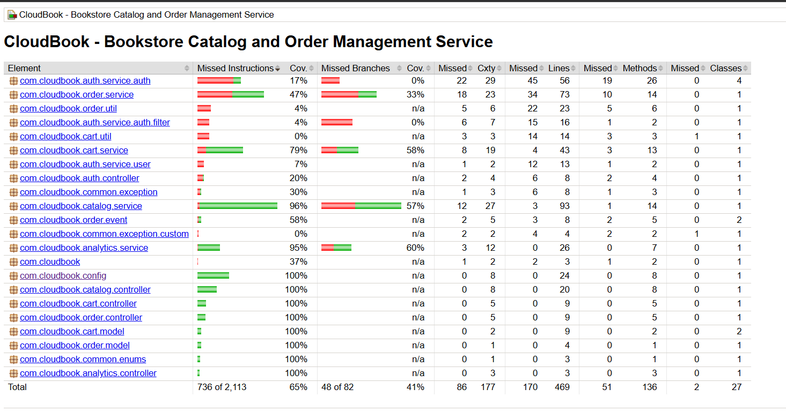

# CloudBook - Bookstore Catalog and Order Management Service

## ✨ Features

- **User Authentication & Authorization**: JWT-based authentication with role-based access control (ADMIN, CUSTOMER)
- **Catalog Management**: CRUD operations for books with filtering, pagination, and stock management
- **Shopping Cart**: Add, remove, and manage items in cart
- **Order Management**: Place orders, view order history, and cancel orders
- **Analytics**: Sales summary and top-selling books analytics for admins
- **Resilience**: Circuit breaker and retry patterns for stock updates
- **API Documentation**: Swagger/OpenAPI integration
- **H2 Database**: In-memory database for development

## 🛠 Tech Stack

- **Framework**: Spring Boot 3.4.4
- **Language**: Java 17
- **Security**: Spring Security with JWT
- **Database**: H2 (In-memory)
- **ORM**: Spring Data JPA
- **Resilience**: Resilience4j (Circuit Breaker, Retry, Rate Limiter)
- **Documentation**: SpringDoc OpenAPI (Swagger)
- **Build Tool**: Maven
- **Containerization**: Docker
- **Orchestration**: Kubernetes

## 📦 Prerequisites

- Java 17 or higher
- Maven 3.6+ (or use included Maven Wrapper)

## 🚀 Setup Instructions

### Local Development

1. **Clone the repository**
   ```bash
   git clone https://github.com/tanmaydubey1947/cloudbook
   cd cloudbook
   ```

2. **Build the project**
   ```bash
   # Using Maven Wrapper (Windows)
   .\mvnw.cmd clean install
   
   # Using Maven Wrapper (Linux/Mac)
   ./mvnw clean install
   
   # Or using Maven directly
   mvn clean install
   ```

3. **Run the application**
   ```bash
   # Using Maven Wrapper
   .\mvnw.cmd spring-boot:run
   
   # Or using Maven
   mvn spring-boot:run
   
   # Or run the JAR directly
   java -jar target/cloudbook-0.0.1-SNAPSHOT.jar
   ```

4. **Access the application**
   - Application: http://localhost:8080
   - Swagger UI: http://localhost:8080/swagger-ui/index.html
   - H2 Console: http://localhost:8080/h2-console
     - JDBC URL: `jdbc:h2:mem:cloudbookdb`
     - Username: `sa`
     - Password: `123`

### Docker

1. **Build the Docker image**
   ```bash
   # First, build the JAR
   mvn clean package
   
   # Build Docker image
   docker build -t cloudbook:latest .
   ```

2. **Run the container**
   ```bash
   docker run -p 8080:8080 cloudbook:latest
   ```

3. **Access the application**
   - Application: http://localhost:8080
   - Swagger UI: http://localhost:8080/swagger-ui/index.html

### Kubernetes

1. **Apply Kubernetes manifests**
   ```bash
   # Apply PersistentVolume
   kubectl apply -f k8s/pv.yaml
   
   # Apply PersistentVolumeClaim
   kubectl apply -f k8s/pvc.yaml
   
   # Apply Deployment
   kubectl apply -f k8s/deployment.yaml
   
   # Apply Service
   kubectl apply -f k8s/service.yaml
   ```

2. **Check deployment status**
   ```bash
   kubectl get pods
   kubectl get services
   ```

3. **Port forward to access the service**
   ```bash
   kubectl port-forward service/cloudbook-service 8080:8080
   ```

## ⚙️ Configuration

Key configuration in `application.properties`:

```properties
# Server
server.port=8080

# JWT
jwt.expiration=3600000  # 1 hour in milliseconds
jwt.secret=aK8O44ZO3WntAHO+ArNlxt3d5y87cwqj1C7uZBpJ9I0=

# H2 Database
spring.datasource.url=jdbc:h2:mem:cloudbookdb
spring.datasource.username=sa
spring.datasource.password=123
spring.h2.console.enabled=true

# Resilience4j
resilience4j.retry.instances.stockUpdateRetry.max-attempts=3
resilience4j.retry.instances.stockUpdateRetry.wait-duration=500ms
resilience4j.ratelimiter.instances.stockUpdateRate.limit-for-period=5
resilience4j.ratelimiter.instances.stockUpdateRate.limit-refresh-period=10s
```


## 🗄️ Database

The application uses **H2 in-memory database** for development. 

- **H2 Console**: http://localhost:8080/h2-console
- **JDBC URL**: `jdbc:h2:mem:cloudbookdb`
- **Username**: `sa`
- **Password**: `123`

**Note**: Data is lost when the application restarts.

## 🛡️ Resilience Patterns

The application implements Resilience4j patterns:

- **Retry**: Stock update operations retry up to 3 times with 500ms delay
- **Rate Limiter**: Stock updates limited to 5 requests per 10 seconds
- **Circuit Breaker**: Protects against cascading failures


## Jacoco Report
```bash
./mvnw clean test jacoco:report
```

